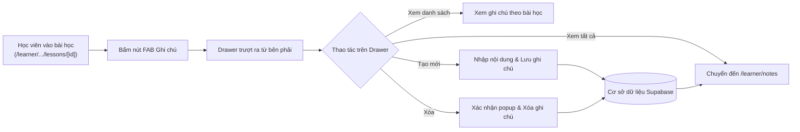

# Kế hoạch Kiểm thử Người dùng cuối (End-User Test Plan) - Chức năng Ghi chú Bài học (Lesson Notes Drawer)

> **Mục tiêu:** Kiểm chứng toàn diện chức năng Ghi chú bài học dạng Drawer trượt trong màn hình học tập (`/learner/courses/[slug]/lessons/[lessonId]`) và tính liên kết đồng bộ với trang Quản lý ghi chú cá nhân (`/learner/notes`) dưới góc nhìn của Học viên (End User / Learner).
> **Phạm vi áp dụng:** Web Application (Frontend Next.js + Backend NestJS REST API + Supabase Database).

---

## 1. Tổng quan & Phạm vi kiểm thử



### 1.1. Phạm vi trong kiểm thử (In-Scope)
- **Giao diện & Tương tác Drawer:** Nút FAB mở drawer, hiệu ứng trượt, đóng drawer (nút X và click backdrop overlay).
- **Tải & Hiển thị dữ liệu:** Trạng thái đang tải (skeleton/spinner), trạng thái rỗng (empty state), danh sách ghi chú lọc theo đúng bài học, hiển thị ngày tạo theo chuẩn Việt Nam (`vi-VN`), bộ đếm số lượng ghi chú.
- **Tạo ghi chú mới:** Kiểm tra validate ô nhập (chặn rỗng/space), xử lý nhiều dòng, trạng thái nút khi đang gửi request ("Đang lưu..."), danh sách tự động cập nhật ngay lập tức.
- **Xóa ghi chú:** Hộp thoại xác nhận (`window.confirm`) trước khi xóa, hủy bỏ xóa giữ nguyên dữ liệu, đồng ý xóa cập nhật lại danh sách và đếm số lượng.
- **Tính đồng bộ đa trang (Cross-page Sync):** Ghi chú tạo từ bài học phải xuất hiện tức thì và tìm kiếm được ở trang `/learner/notes`. Sửa/xóa ở trang chung phản ánh vào bài học.
- **Bảo mật & Phân quyền dữ liệu (Multi-tenant Data Isolation):** Ghi chú của học viên A hoàn toàn vô hình trước học viên B. Xác thực token (JWT).
- **Trường hợp ngoại lệ (Edge Cases):** Bài học có slug tĩnh (non-UUID), ghi chú nội dung cực dài, ký tự đặc biệt, ngắt kết nối mạng.
- **Giao diện đa thiết bị (Responsive):** Desktop (1920x1080, 1366x768) và Mobile/Tablet (< 768px).

### 1.2. Ngoài phạm vi (Out-of-Scope)
- Chỉnh sửa nội dung ghi chú trực tiếp trong drawer (tính năng sửa hiện tập trung tại trang `/learner/notes`).
- Đính kèm tệp tin đa phương tiện (ảnh, audio, video) vào ghi chú.

---

## 2. Môi trường & Điều kiện Tiên quyết

### 2.1. Dữ liệu thử nghiệm (Test Data)
- **Tài khoản kiểm thử:**
  - `Learner A` (Học viên chính): `learner.test1@example.com` / `Password123!`
  - `Learner B` (Học viên đối chiếu bảo mật): `learner.test2@example.com` / `Password123!`
- **Khóa học & Bài học:**
  - Khóa học đã ghi danh (enrolled): ví dụ khóa C# Fundamentals (`csharp-fundamentals`).
  - Bài học 1: Bài học có ID dạng UUID hợp lệ (ví dụ `3fa85f64-5717-4562-b3fc-2c963f66afa6`).
  - Bài học 2: Bài học khác cùng khóa học (để kiểm tra tính cô lập ghi chú theo từng bài).
  - Bài học fallback slug (nếu có): URL bài học dạng chữ (ví dụ `/lessons/what-is-csharp`).

### 2.2. Trình duyệt & Thiết bị
- Desktop: Google Chrome (phiên bản mới nhất), Firefox, Safari/Edge.
- Mobile viewport: Chế độ giả lập DevTools (iPhone 14 / Samsung Galaxy S20, viewport 375x812 - 412x915).

---

## 3. Ma trận Kịch bản Kiểm thử Chi tiết (Test Scenarios Matrix)

> [!NOTE]
> Mức độ ưu tiên:
> - **P0 (Critical):** Luồng nghiệp vụ cốt lõi, lỗi sẽ làm tắc nghẽn trải nghiệm người dùng.
> - **P1 (High):** Chức năng quan trọng, ảnh hưởng trực tiếp đến dữ liệu và tính toàn vẹn.
> - **P2 (Medium):** Trải nghiệm UX, giao diện responsive, trường hợp biên.

### Nhóm 1: Giao diện & Điều hướng Drawer (Drawer UI & Navigation)

| Mã TC | Tên Test Case | Điều kiện tiên quyết | Các bước thực hiện | Kết quả mong đợi | Mức độ |
| :--- | :--- | :--- | :--- | :--- | :---: |
| **TC-NAV-01** | Hiển thị nút FAB Ghi chú | Đang ở màn hình chi tiết bài học (`/learner/courses/[slug]/lessons/[lessonId]`) | Quan sát góc dưới bên phải màn hình | Nút tròn màu xanh đậm (`#0f3741`), icon cuốn sổ/văn bản, fixed nổi trên nội dung, có tooltip "Ghi chú bài học". | **P0** |
| **TC-NAV-02** | Kích hoạt mở Drawer | Đang ở màn hình bài học | Click vào nút FAB ghi chú | 1. Drawer trượt mượt mà từ cạnh phải vào màn hình.<br>2. Xuất hiện lớp phủ làm mờ nền (backdrop blur).<br>3. Tiêu đề hiển thị "Ghi chú bài học" và "Lưu lại kiến thức quan trọng". | **P0** |
| **TC-NAV-03** | Đóng Drawer bằng nút 'X' | Drawer đang mở | Click vào icon `X` ở góc trên bên phải Drawer | Drawer đóng lại, biến mất khỏi màn hình, trả lại toàn bộ không gian học tập. | **P0** |
| **TC-NAV-04** | Đóng Drawer bằng Backdrop | Drawer đang mở | Click vào khoảng không gian tối/mờ bên ngoài Drawer | Drawer tự động đóng lại giống như bấm nút 'X'. | **P1** |
| **TC-NAV-05** | Điều hướng sang trang tất cả ghi chú | Drawer đang mở | Click liên kết "View all notes →" ở chân trang (Footer) | Trình duyệt chuyển hướng đến `/learner/notes` hiển thị toàn bộ ghi chú của tài khoản. | **P1** |

---

### Nhóm 2: Xem danh sách & Trạng thái tải dữ liệu (Read & States)

| Mã TC | Tên Test Case | Điều kiện tiên quyết | Các bước thực hiện | Kết quả mong đợi | Mức độ |
| :--- | :--- | :--- | :--- | :--- | :---: |
| **TC-VIEW-01** | Trạng thái đang tải (Loading Spinner) | Drawer đang đóng, mạng mô phỏng Fast 3G | Click nút FAB mở Drawer | Xuất hiện vòng quay tròn (spinner) ở giữa vùng danh sách trong khi API đang tải dữ liệu. | **P1** |
| **TC-VIEW-02** | Trạng thái chưa có ghi chú (Empty State) | Bài học chưa từng được tạo ghi chú nào | Mở Drawer bài học | Danh sách hiển thị thông điệp thân thiện: *"Chưa có ghi chú nào cho bài học này"*, số lượng hiển thị *"0 ghi chú"*. | **P0** |
| **TC-VIEW-03** | Hiển thị danh sách ghi chú đúng bài học | Bài học A đã có 2 ghi chú, Bài học B có 1 ghi chú | 1. Mở Drawer ở Bài học A<br>2. Chuyển sang Bài học B, mở Drawer | 1. Ở Bài học A: Hiển thị đúng 2 ghi chú của Bài học A.<br>2. Ở Bài học B: Chỉ hiển thị 1 ghi chú của Bài học B, không lẫn lộn với Bài học A. | **P0** |
| **TC-VIEW-04** | Định dạng ngày tạo chuẩn Việt Nam | Bài học đã có ghi chú | Quan sát dòng ngày tháng ở góc dưới mỗi thẻ ghi chú | Định dạng hiển thị đúng định dạng ngày tháng tiếng Việt (ví dụ: `27/09/2026`). | **P2** |
| **TC-VIEW-05** | Bài học có fallback slug (non-UUID) | Bài học sử dụng slug dạng chữ tĩnh (ví dụ `what-is-csharp`) | Mở Drawer ghi chú | Drawer mở bình thường, không xuất hiện popup lỗi màu đỏ, console không có lỗi `ParseUUIDPipe` hoặc Postgres syntax error. | **P1** |

---

### Nhóm 3: Tạo ghi chú mới (Create Note)

| Mã TC | Tên Test Case | Điều kiện tiên quyết | Các bước thực hiện | Kết quả mong đợi | Mức độ |
| :--- | :--- | :--- | :--- | :--- | :---: |
| **TC-ADD-01** | Chặn lưu khi nội dung rỗng hoặc chỉ có khoảng trắng | Drawer đang mở | 1. Để ô textarea rỗng<br>2. Nhập toàn dấu cách `"   "` | Nút "Lưu ghi chú" bị mờ (disabled), con trỏ chuột dạng `not-allowed`, không thể click gửi request. | **P0** |
| **TC-ADD-02** | Tạo ghi chú thông thường thành công | Drawer đang mở | 1. Nhập nội dung: `"Học về cú pháp khai báo biến trong C#"`<br>2. Bấm "Lưu ghi chú" | 1. Nút lưu đổi trạng thái sang "Đang lưu..." trong chốc lát.<br>2. Ghi chú mới xuất hiện ngay trong danh sách.<br>3. Ô nhập textarea được xóa trống.<br>4. Bộ đếm tăng lên `+1`. | **P0** |
| **TC-ADD-03** | Ghi chú nhiều dòng & giữ nguyên định dạng | Drawer đang mở | Nhập đoạn code hoặc danh sách gạch đầu dòng:<br>`Line 1: public class Program`<br>`Line 2: { ... }` | Thẻ ghi chú hiển thị đúng các dòng ngắt cách (`whitespace-pre-wrap`), không bị gộp chung thành một dòng. | **P1** |
| **TC-ADD-04** | Nhập ghi chú có ký tự đặc biệt & emoji | Drawer đang mở | Nhập: `"Chú ý quan trọng! 🚀 Cần nhớ: a < b && b > c; key = 'value'"` | Lưu thành công, hiển thị chính xác mọi ký tự và icon không bị lỗi font hay mã hóa HTML thô. | **P2** |
| **TC-ADD-05** | Tạo nhiều ghi chú liên tiếp gây tràn danh sách (Scroll) | Đã có sẵn 4-5 ghi chú | Tạo thêm 3 ghi chú mới | Vùng danh sách tự động xuất hiện thanh cuộn đứng mượt mà (`overflow-y-auto`), ô nhập ghi chú phía dưới vẫn cố định không bị che lấp. | **P1** |

---

### Nhóm 4: Xóa ghi chú & Xác nhận an toàn (Delete Note & Confirmation)

| Mã TC | Tên Test Case | Điều kiện tiên quyết | Các bước thực hiện | Kết quả mong đợi | Mức độ |
| :--- | :--- | :--- | :--- | :--- | :---: |
| **TC-DEL-01** | Xuất hiện hộp thoại xác nhận khi bấm Xóa | Có ít nhất 1 ghi chú trong Drawer | Click vào nút icon Xóa (`X` / Trash) trên thẻ ghi chú | Trình duyệt bật hộp thoại xác nhận với nội dung: *"Bạn có chắc chắn muốn xóa ghi chú này?"*. | **P0** |
| **TC-DEL-02** | Hủy thao tác xóa | Hộp thoại xác nhận đang hiển thị | Bấm "Cancel" (Hủy bỏ) hoặc phím `Esc` | Hộp thoại đóng lại, ghi chú vẫn còn nguyên vẹn trong danh sách, không có request DELETE nào gửi đi. | **P0** |
| **TC-DEL-03** | Xác nhận xóa thành công | Hộp thoại xác nhận đang hiển thị | Bấm "OK" (Đồng ý) | Ghi chú tương ứng biến mất khỏi danh sách ngay lập tức, bộ đếm số lượng giảm `1`. | **P0** |
| **TC-DEL-04** | Xóa ghi chú duy nhất còn lại | Danh sách chỉ có đúng 1 ghi chú | Bấm Xóa -> Chọn "OK" | Ghi chú biến mất, giao diện chuyển mượt mà về trạng thái rỗng: *"Chưa có ghi chú nào cho bài học này"*, đếm hiển thị *"0 ghi chú"*. | **P1** |

---

### Nhóm 5: Tính nhất quán & Đồng bộ đa trang (Cross-Page Sync)

| Mã TC | Tên Test Case | Điều kiện tiên quyết | Các bước thực hiện | Kết quả mong đợi | Mức độ |
| :--- | :--- | :--- | :--- | :--- | :---: |
| **TC-SYNC-01** | Đồng bộ từ Drawer sang trang Quản lý ghi chú | Tạo ghi chú `"Ghi chú test đồng bộ A1"` trong Drawer bài học | 1. Mở tab mới hoặc click "View all notes →" đến `/learner/notes`<br>2. Xem danh sách | Ghi chú `"Ghi chú test đồng bộ A1"` xuất hiện trong danh sách ghi chú tại trang `/learner/notes`. | **P0** |
| **TC-SYNC-02** | Tìm kiếm ghi chú bài học tại `/learner/notes` | Đã có ghi chú tạo từ bài học | Tại trang `/learner/notes`, nhập từ khóa vào ô tìm kiếm | Kết quả tìm kiếm trả về đúng ghi chú đã tạo từ bài học. | **P1** |
| **TC-SYNC-03** | Xóa ghi chú ở trang `/learner/notes` phản ánh lại Drawer | Có ghi chú tạo từ bài học | 1. Xóa ghi chú đó tại trang `/learner/notes`<br>2. Quay lại trang bài học, bấm mở lại Drawer | Ghi chú đã bị xóa không còn xuất hiện trong Drawer của bài học nữa. | **P1** |

---

### Nhóm 6: Bảo mật, Phân quyền & Khả năng chịu lỗi (Security & Fault Tolerance)

| Mã TC | Tên Test Case | Điều kiện tiên quyết | Các bước thực hiện | Kết quả mong đợi | Mức độ |
| :--- | :--- | :--- | :--- | :--- | :---: |
| **TC-SEC-01** | Cô lập dữ liệu giữa các học viên | Learner A tạo ghi chú bí mật `"Ghi chú riêng của A"` tại bài học X | 1. Đăng xuất Learner A, đăng nhập bằng Learner B<br>2. Learner B truy cập cùng bài học X và mở Drawer | Learner B hoàn toàn KHÔNG thấy ghi chú của Learner A (danh sách của B rỗng hoặc chỉ có ghi chú của B). | **P0** |
| **TC-SEC-02** | Xử lý khi phiên đăng nhập hết hạn (401 Unauthorized) | Đang mở Drawer bài học, xóa cookie auth/JWT trong DevTools | Nhập nội dung và bấm "Lưu ghi chú" | Không làm sập ứng dụng (no white screen crash); thông báo lỗi được ghi nhận hoặc chuyển hướng yêu cầu đăng nhập lại. | **P1** |
| **TC-SEC-03** | Chống tấn công XSS (Cross-Site Scripting) | Drawer đang mở | Nhập chuỗi: `<script>alert('xss')</script><b>Bold Text</b>` và bấm Lưu | Chuỗi hiển thị dưới dạng văn bản an toàn thuần túy, script tuyệt đối không được thực thi. | **P0** |
| **TC-SEC-04** | Thử nghiệm mất kết nối mạng đột ngột (Offline) | Drawer đang mở, tắt mạng (DevTools Offline) | Nhập ghi chú và bấm Lưu | Nút lưu kết thúc trạng thái "Đang lưu...", ứng dụng không bị treo, thông báo lỗi trong console `Failed to create note`. | **P2** |

---

### Nhóm 7: Giao diện Đáp ứng (Responsive & UX Usability)

| Mã TC | Tên Test Case | Điều kiện tiên quyết | Các bước thực hiện | Kết quả mong đợi | Mức độ |
| :--- | :--- | :--- | :--- | :--- | :---: |
| **TC-RESP-01** | Trải nghiệm trên Desktop/Laptop | Màn hình 1366x768 hoặc 1920x1080 | Mở Drawer bài học trong khi trình soạn thảo code/video đang hiển thị | Drawer trượt chiếm tối đa `max-w-md` (khoảng 448px) bên phải, không che mất thanh tiêu đề trên cùng, trải nghiệm mượt mà. | **P1** |
| **TC-RESP-02** | Trải nghiệm trên Mobile/Tablet | Viewport 375px (Mobile Portrait) | 1. Mở Drawer<br>2. Focus vào ô nhập textarea để bật bàn phím ảo | 1. Drawer tự mở rộng toàn màn hình (`w-full`).<br>2. Bàn phím ảo hiện lên không làm che lấp nút "Lưu ghi chú" hoặc vỡ bố cục. | **P1** |

---

## 4. Quy trình Thực hiện & Tiêu chí Nghiệm thu (Acceptance Criteria)

### 4.1. Trình tự thực hiện đề xuất
1. **Kiểm tra Sanity (Smoke Test):** Mở bài học -> Bấm FAB -> Thấy drawer -> Đóng drawer.
2. **Kiểm tra Chức năng chính (Happy Path):** Thêm 1 ghi chú -> Thấy hiển thị -> Bấm xóa -> Xác nhận xóa -> Danh sách về 0.
3. **Kiểm tra Đồng bộ (Integration):** Tạo ghi chú -> Sang `/learner/notes` kiểm tra.
4. **Kiểm tra Bảo mật (Security & Isolation):** Thử nghiệm với 2 tài khoản khác nhau.
5. **Kiểm tra Biên & Ngoại lệ (Edge cases):** Thử ký tự lạ, fallback slug, mất mạng.

### 4.2. Tiêu chí Chấp thuận (Definition of Done)
- [ ] 100% các Test Case mức **P0 (Critical)** và **P1 (High)** đạt trạng thái **PASS**.
- [ ] Không có lỗi console nghiêm trọng (Uncaught TypeError / white screen).
- [ ] Không rò rỉ dữ liệu giữa các tài khoản học viên.
- [ ] Trải nghiệm mượt mà trên cả máy tính và điện thoại.

---

## 5. Mẫu Báo cáo Lỗi (Defect / Bug Report Template)

Khi phát hiện lỗi trong quá trình chạy kiểm thử, điền theo mẫu sau:

```markdown
**Mã lỗi:** BUG-NOTE-[Số thứ tự]
**Mã Test Case liên quan:** TC-XXX-XX
**Mô tả tóm tắt:** [Ví dụ: Không hiện popup xác nhận khi bấm nút xóa]
**Mức độ nghiêm trọng:** Blocker / Major / Minor
**Môi trường:** Chrome 128 / macOS / Windows / iPhone
**Các bước tái hiện:**
1. Vào bài học `/learner/courses/csharp/lessons/uuid-1`
2. Mở Drawer ghi chú
3. Bấm vào icon xóa ở ghi chú đầu tiên
**Kết quả thực tế (Actual):** Ghi chú bị xóa ngay lập tức không có hộp thoại hỏi lại.
**Kết quả mong đợi (Expected):** Phải xuất hiện popup 'Bạn có chắc chắn muốn xóa ghi chú này?'.
**Ảnh / Video đính kèm:** [screenshot / recording]
```

